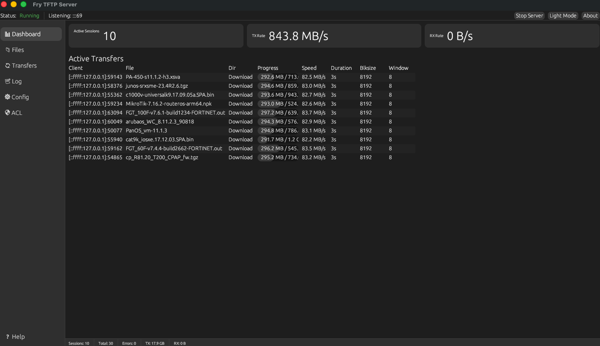
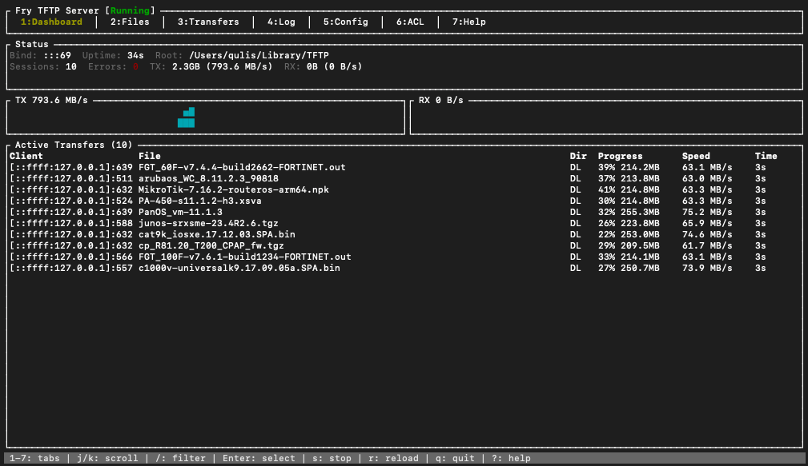

<p align="center">
  
</p>

<h1 align="center">Fry TFTP Server</h1>

<p align="center">
  <strong>High-performance, cross-platform TFTP server with GUI, TUI, and headless modes</strong>
</p>

<p align="center">
  <a href="https://github.com/qulisun/fry-tftp-server/actions"></a>
  <a href="https://github.com/qulisun/fry-tftp-server/releases"></a>
  
  
  <a href="LICENSE"></a>
  
</p>

---

## Overview

Fry TFTP Server is a modern TFTP server built in Rust, designed for network engineers, sysadmins, and anyone who needs fast, reliable firmware distribution and PXE boot infrastructure. It supports all major TFTP RFCs including sliding window transfers (RFC 7440) for throughput up to **500+ MB/s**.

### Why Fry?

- **3 interfaces** in one binary &mdash; GUI, terminal UI, or headless daemon
- **10x faster** than traditional TFTP servers with sliding window & mmap
- **Enterprise-ready** &mdash; ACL, rate limiting, hot-reload config, service integration
- **Cross-platform** &mdash; runs on Windows, macOS, and Linux
- **Multilingual** &mdash; English, Russian, German, Spanish, French

---

## Screenshots

### GUI Mode — 10 concurrent firmware downloads at 843 MB/s


### TUI Mode — Terminal interface with real-time monitoring


---

## Features

| Category | Details |
|----------|---------|
| **Protocol** | RFC 1350, 2347 (OACK), 2348 (Blocksize), 2349 (Timeout/Tsize), 7440 (Windowsize) |
| **Transfer modes** | Octet (binary), Netascii (text) |
| **Performance** | Sliding window (up to 64 blocks), memory-mapped I/O, buffer pooling |
| **Security** | IP-based ACL (whitelist/blacklist, CIDR), per-IP rate limiting, session limits, path traversal protection, symlink policy |
| **Configuration** | TOML config with hot-reload (file watcher + SIGHUP), environment variables, CLI overrides |
| **GUI mode** | Dashboard, file browser, transfer history, log viewer, config editor, ACL manager, system tray |
| **TUI mode** | Full-featured terminal interface with the same capabilities |
| **Headless mode** | Daemon with IPC control socket (Unix/Windows named pipe) |
| **Deployment** | Docker, systemd, launchd, Windows Service |
| **Internationalization** | 5 languages: EN, RU, DE, ES, FR (auto-detected from OS locale) |

---

## Quick Start

### Download

Get the latest release from the [Releases page](https://github.com/qulisun/fry-tftp-server/releases), or build from source:

```bash
git clone https://github.com/qulisun/fry-tftp-server.git
cd fry-tftp-server
cargo build --release
```

### Run

```bash
# GUI mode (default)
./target/release/fry-tftp-server

# TUI mode
./target/release/fry-tftp-server --tui

# Headless daemon
./target/release/fry-tftp-server --headless

# Custom options
./target/release/fry-tftp-server --headless -p 6969 -r /srv/tftp --allow-write
```

### macOS

Download the `.dmg` from [Releases](https://github.com/qulisun/fry-tftp-server/releases), open it, and drag **Fry TFTP Server** to Applications.

> **Note:** On first launch, right-click the app and select **Open** (macOS Gatekeeper). Port 69 works without sudo on macOS Ventura+.

### Windows

Download `fry-tftp-server-windows-x86_64.zip` from [Releases](https://github.com/qulisun/fry-tftp-server/releases), extract, and double-click `fry-tftp-server.exe`.

> **First launch:** Windows SmartScreen may show "Windows protected your PC". Click **More info** → **Run anyway**. This happens because the binary is not code-signed.
>
> **Alternative:** Right-click the `.exe` → **Properties** → check **Unblock** → **OK**. This removes the SmartScreen warning permanently for this file.
>
> **PowerShell:** `Unblock-File -Path .\fry-tftp-server.exe`

Port 69 requires Administrator privileges on Windows. Right-click → **Run as Administrator**, or use `-p <port>` with a port above 1024.

---

## Build Options

| Command | Description |
|---------|-------------|
| `cargo build --release` | Full build (GUI + TUI + headless) |
| `cargo build --release --no-default-features` | Headless only (minimal, for Docker/servers) |
| `cargo build --release --no-default-features --features tui` | TUI only |
| `cargo build --release --features gui` | GUI only |

### Linux GUI Dependencies

```bash
sudo apt-get install -y libglib2.0-dev libgtk-3-dev libxdo-dev libxcb-shape0-dev libxcb-xfixes0-dev
```

---

## Configuration

Configuration is loaded from platform-specific paths automatically:

| Platform | Path |
|----------|------|
| **macOS** | `~/Library/Preferences/fry-tftp-server/config.toml` |
| **Linux** | `~/.config/fry-tftp-server/config.toml` |
| **Windows** | `%APPDATA%\fry-tftp-server\config.toml` |

Override with `-c /path/to/config.toml`. See [`config/default.toml`](config/default.toml) for all options.

### Priority (highest to lowest)

```
CLI flags  >  Environment (TFTP_SERVER_*)  >  Config file  >  Built-in defaults
```

### Environment Variables

| Variable | Example |
|----------|---------|
| `TFTP_SERVER_PORT` | `69` |
| `TFTP_SERVER_BIND_ADDRESS` | `0.0.0.0` |
| `TFTP_SERVER_ROOT` | `/srv/tftp` |
| `TFTP_SERVER_ALLOW_WRITE` | `true` |
| `TFTP_SERVER_LOG_LEVEL` | `info` |
| `TFTP_SERVER_MAX_SESSIONS` | `100` |
| `TFTP_SERVER_IP_VERSION` | `dual` |

---

## Deployment

### Docker

```bash
docker build -t fry-tftp .
docker run --net=host -v /srv/tftp:/srv/tftp fry-tftp
```

> **Note:** TFTP uses ephemeral UDP ports per session. `--net=host` is required for full functionality.

### systemd (Linux)

```bash
sudo cp deploy/fry-tftp-server.service /etc/systemd/system/
sudo systemctl daemon-reload
sudo systemctl enable --now fry-tftp-server
```

### launchd (macOS)

```bash
sudo cp deploy/com.fry-tftp-server.plist /Library/LaunchDaemons/
sudo launchctl load /Library/LaunchDaemons/com.fry-tftp-server.plist
```

### Windows

**GUI mode** — just double-click `fry-tftp-server.exe`. No console window, no setup needed.

**As a Windows Service** (runs in background, survives reboot):

```powershell
# Run PowerShell as Administrator

# Install the service
fry-tftp-server.exe --install-service

# Start
Start-Service FryTFTPServer

# Check status
Get-Service FryTFTPServer

# Stop
Stop-Service FryTFTPServer

# Uninstall
fry-tftp-server.exe --uninstall-service
```

The service runs in headless mode and can be managed via `services.msc` or PowerShell. Configuration is loaded from `%APPDATA%\fry-tftp-server\config.toml`.

---

## CLI Reference

```
Usage: fry-tftp-server [OPTIONS]

Options:
      --gui                Run in GUI mode (default)
      --tui                Run in TUI mode
      --headless           Run in headless mode (daemon)
  -c, --config <FILE>      Path to config file
  -r, --root <DIR>         Root directory
  -p, --port <PORT>        Port number (default: 69)
  -b, --bind <ADDR>        Bind address (default: ::)
      --allow-write        Allow write requests (WRQ)
      --max-sessions <N>   Maximum parallel sessions
      --blksize <N>        Maximum block size
      --windowsize <N>     Maximum window size
      --ip-version <V>     IP version: dual | v4 | v6
  -v, --verbose            Increase verbosity (-v, -vv, -vvv)
  -q, --quiet              Quiet mode (errors only)
  -h, --help               Print help
  -V, --version            Print version
```

---

## RFC Compliance

| RFC | Title | Status |
|-----|-------|:------:|
| [RFC 1350](https://datatracker.ietf.org/doc/html/rfc1350) | TFTP Protocol (Revision 2) | Fully implemented |
| [RFC 2347](https://datatracker.ietf.org/doc/html/rfc2347) | Option Extension (OACK) | Fully implemented |
| [RFC 2348](https://datatracker.ietf.org/doc/html/rfc2348) | Blocksize Option | Fully implemented |
| [RFC 2349](https://datatracker.ietf.org/doc/html/rfc2349) | Timeout & Transfer Size | Fully implemented |
| [RFC 7440](https://datatracker.ietf.org/doc/html/rfc7440) | Windowsize Option | Fully implemented |

---

## Performance

Benchmarked on Apple Silicon (M-series), localhost, single session:

| File Size | Default (512B/win=1) | Optimized (8KB/win=8) | Max (64KB/win=16) |
|:---------:|:--------------------:|:---------------------:|:-----------------:|
| 1 MB | 19 MB/s | 993 MB/s | 2,365 MB/s |
| 10 MB | 31 MB/s | 1,227 MB/s | 3,950 MB/s |
| 100 MB | 30 MB/s | 1,031 MB/s | 4,009 MB/s |
| 1 GB | -- | 212 MB/s | 3,392 MB/s |
| 5 GB | -- | 235 MB/s | 207 MB/s |

---

## TUI Keybindings

| Key | Action |
|-----|--------|
| `1`-`7` | Switch tabs |
| `Tab` / `Shift+Tab` | Next / previous tab |
| `j` / `k` | Scroll down / up |
| `Enter` | Select / open / edit |
| `Esc` | Back / cancel / clear filter |
| `/` | Search / filter |
| `s` | Start / stop server |
| `r` | Reload config & files |
| `a` / `e` / `d` | Add / edit / delete ACL rule |
| `q` | Quit |
| `?` | Help overlay |

---

## Firewall

TFTP requires UDP port 69 (main) plus ephemeral ports for sessions.

```bash
# Linux (ufw)
sudo ufw allow 69/udp

# macOS — port 69 works without sudo on Ventura+
# Use -p <port> with port > 1024 on older versions

# Windows (PowerShell, run as Admin)
New-NetFirewallRule -DisplayName "TFTP" -Direction Inbound -Protocol UDP -LocalPort 69 -Action Allow
```

---

## Contributing

Contributions are welcome! Please:

1. Fork the repository
2. Create a feature branch (`git checkout -b feature/my-feature`)
3. Run `cargo fmt` and `cargo clippy --all-features` before committing
4. Ensure all tests pass (`cargo test`)
5. Submit a Pull Request

---

## License

This project is licensed under the [MIT License](LICENSE).

---

<p align="center">
  <sub>Built with Rust, egui, ratatui, tokio</sub><br>
  <sub>Created by <a href="https://github.com/qulisun">Viacheslav Gordeev</a></sub>
</p>
